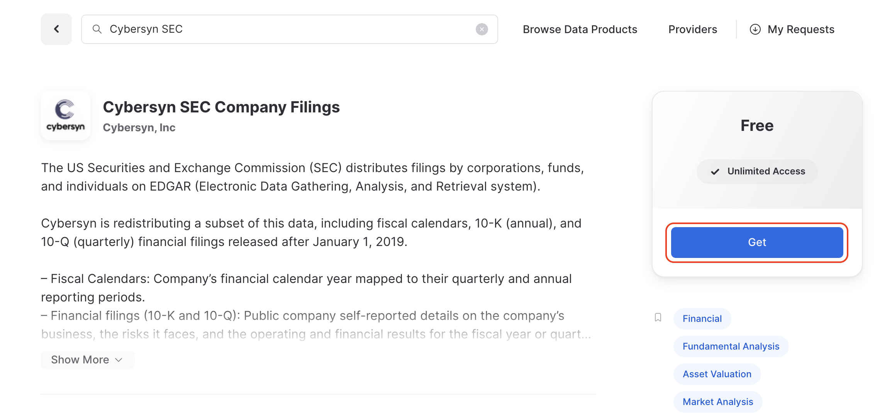
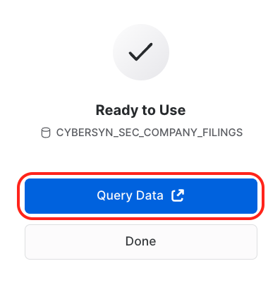
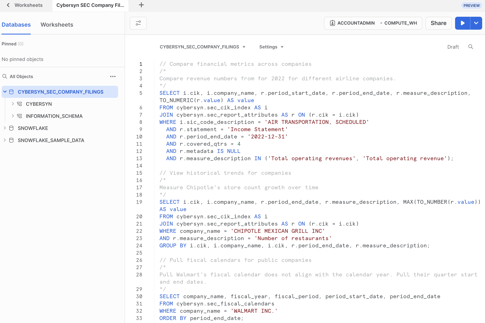

summary: This guide provides the instructions for writing an LLM chatbot in Streamlit on your Snowflake data.
id: llm_chatbot_streamlit
categories: data-science-&-ml,app-development
environments: web
status: Hidden 
feedback link: https://github.com/Snowflake-Labs/sfguides/issues
tags: Snowpark Python, Streamlit, OpenAI, LLMs
authors: Joshua Carroll, Richard Meng, Caroline Frasca

# Frosty: Build an LLM Chatbot in Streamlit on your Snowflake Data
<!-- ------------------------ -->
## Overview 
Duration: 2


In this guide, we will build an LLM-powered chatbot named "Frosty" that performs data exploration and answers questions by writing and executing SQL queries on Snowflake data.

The application uses Streamlit and Snowflake and can be plugged into your LLM of choice, alongside data from Snowflake Marketplace. By the end of the session, you will have an interactive web application chatbot which can converse and answer questions based on a public job listings dataset.

### Key Features & Technology
* Large Language Models (LLMs)
* Streamlit
* Snowflake Marketplace

### What is Streamlit?
Streamlit is an open-source Python library that enables developers to quickly create, deploy, and share web apps from Python scripts. Learn more about [Streamlit](https://streamlit.io/).

### What is a Large Language Model (LLM)?
A large language model, or LLM, is a deep learning algorithm that can recognize, summarize, translate, predict and generate text and other content based on knowledge gained from massive datasets. Some examples of popular LLMs are [GPT-4](https://openai.com/research/gpt-4), [GPT-3](https://openai.com/blog/gpt-3-apps), [BERT](https://cloud.google.com/ai-platform/training/docs/algorithms/bert-start), [LLaMA](https://ai.facebook.com/blog/large-language-model-llama-meta-ai/), and [LaMDA](https://blog.google/technology/ai/lamda/).

### What is OpenAI?
OpenAI is the AI research and deployment company behind ChatGPT, GPT-4 (and its predecessors), DALL-E, and other notable offerings. Learn more about [OpenAI](https://openai.com/). We use OpenAI in this guide, but you are welcome to use the large language model of your choice in its place.

### What You’ll Learn

* How to create a web application from a Python script with Streamlit
* How to use `st.experimental_connection` to connect your Streamlit app to Snowflake
* How to 

<!-- ### What You’ll Need 
- A [GitHub](https://github.com/) Account 
- [VSCode](https://code.visualstudio.com/download) Installed
- [NodeJS](https://nodejs.org/en/download/) Installed
- [GoLang](https://golang.org/doc/install) Installed -->

### Prerequisites

* Accountadmin role access in Snowflake or a [Snowflake trial account](https://signup.snowflake.com/)
* Access (API Key) for OpenAI or another Large Language Model
* Basic knowledge of SQL, database concepts, and objects
* Familiarity with Python.  All code for the lab is provided.
* Ability to install and run software on your computer
* [VSCode](https://code.visualstudio.com/download) installed

### What You’ll Build 

<!-- ------------------------ -->
## Prepare your environment
Duration: 8

1. Install [Miniconda](https://docs.conda.io/en/latest/miniconda.html) to manage a separate environment by selecting the appropriate installer link for your operating system and Python version from [Anaconda's website](https://docs.conda.io/en/latest/miniconda.html#latest-miniconda-installer-links).
2. Open the terminal or command prompt and create a folder for your project. Let's call it `llm-chatbot`.

> IMPORTANT:
> If you are using a machine wth Apple M1 chip, follow [these instructions](https://docs.snowflake.com/en/developer-guide/snowpark/python/setup) to create the virtual environment and install Snowpark Python instead of what's described below. Activate the environment created in those instructions by running `conda activate py38_env`, install OpenAI by running `conda install openai`, and proceed to step 6 below.

3. Create environment by running `conda create --name snowpark -c https://repo.anaconda.com/pkgs/snowflake python=3.8`
4. Activate conda environment by running `conda activate snowpark`
5. Install Snowpark for Python and openai by running `conda install -c https://repo.anaconda.com/pkgs/snowflake snowflake-snowpark-python openai`
6. Install Streamlit by running `pip install streamlit` or `conda install streamlit`

---

### Troubleshooting `pyarrow` related issues

- If you have `pyarrow` already installed, uninstall it before installing Snowpark.
- If you do not have `pyarrow` installed, you do not need to install it yourself; installing Snowpark automatically installs the appropriate version.
- Do not reinstall a different version of `pyarrow` after installing Snowpark.

<!-- ------------------------ -->
## Accessing Data on Snowflake Marketplace

Duration: 4

Snowflake Marketplace provides visibility to a wide variety of datasets from third-party data stewards which broaden access to data points used to transform business processes. Snowflake Marketplace also removes the need to integrate and model data by providing secure access to data sets fully maintained by the data provider.

### Log into Snowsight

1. In a supported web browser, navigate to [https://app.snowflake.com](https://app.snowflake.com).
2. Provide your account name or account URL. If you’ve previously signed in to Snowsight, you might see an account name that you can select.
3. Sign in using your Snowflake account credentials.

You can also access Snowsight from the Classic Console:
1. Sign in to the Classic Console.
2. In the navigation menu, select Snowsight.
3. Snowsight opens in a new tab.

### Obtain dataset from Snowflake Marketplace

1. At the top left corner, make sure you are logged in as ACCOUNTADMIN (switch role to ACCOUNTADMIN if not).
2. Click on **"Marketplace"** or navigate to [https://app.snowflake.com/marketplace](https://app.snowflake.com/marketplace).
3. In the search bar, enter "Cybersyn SEC" and click on the tile box labeled **"Cybersyn SEC Company Filings."**


4. At the top right corner, select **"Get."**


5. Select the appropriate roles to access the database being created and accept the Snowflake consumer terms and Cybersyn's terms of use.
6. Select **"Query Data,"** which will open a worksheet with example queries.





Now that we have the dataset we'll be using for our application, we can get started with Streamlit.

<!-- 8. We are interested in ... data, so we will use this query to explore the data for the application:
`Add a question here`

    ```sql
    Add a sample SQL query here for the relevant table
    ``` -->

<!-- ------------------------ -->
## Setting up Streamlit environment
Duration: 8

### Run an example Streamlit app
1. Head back over to the command line and navigate to your `llm-chatbot` folder.
2. Run an example Streamlit app by entering `streamlit hello`.


### Configure secrets file
Since our application will connect to Snowflake and OpenAI, we need a way to securely store our credentials. Luckily, Streamlit's secrets feature allows us to store secrets securely and access them in our Streamlit app as environment variables.

1. Add a folder within your `llm-chatbot` folder called `.streamlit`. Using the command line, you can do this by entering `mkdir .streamlit`.
2. Within the `.streamlit` folder, add a file called `secrets.toml`. Using the command line, you can do this by first navigating to the `.streamlit` folder via `cd .streamlit` and then entering `touch secrets.toml.`

#### Add Snowflake credentials to `secrets.toml`
We need to add the Snowflake `user`, `password`, `warehouse`, `role`, and `account` to our secrets file. Copy the following format, replacing the placeholder credentials with your actual credentials.

```toml
# .streamlit/secrets.toml

[connections.snowpark]
user = "<jdoe>"
password = "<my_trial_pass>"
warehouse = "COMPUTE_WH"
role = "ACCOUNTADMIN"
account = "<account-id>"
```

#### Add OpenAI credentials to `secrets.toml`
We also need to add our OpenAI API key to our secrets file. Copy the following format, replacing the placeholder API key with your actual API key.

```toml
# .streamlit/secrets.toml

OPENAI_API_KEY = "sk-2v...X"
```

<!-- - Do a streamlit hello / hello world app
- Add snowflake creds to secrets and confirm query access to the table from the last section to st.dataframe
- Add openai key to secrets and confirm openai access is working (simple completion) -->

#### Full contents of secrets.toml

```toml
# .streamlit/secrets.toml

OPENAI_API_KEY = "sk-2v...X"

[connections.snowpark]
user = "<jdoe>"
password = "<my_trial_pass>"
warehouse = "COMPUTE_WH"
role = "ACCOUNTADMIN"
account = "<account-id>"
```

### Validate credentials
Let's validate that our Snowflake and OpenAI credentials are working as expected.

1. Add a file called `frosty_app.py` at the root of your `llm-chatbot` folder.
2. 


<!-- ------------------------ -->
## Build a simple chatbot application
Duration: 1

<!-- ------------------------ -->
## Add prompt engineering and SQL extraction
Duration: 1

<!-- ------------------------ -->
## Explore the data via natural language
Duration: 1

// *TODO: Add sample questions*

<!-- ------------------------ -->
## Tips, Tricks and next steps
Duration: 1

<!-- ------------------------ -->
## Conclusion and resources
Duration: 1
