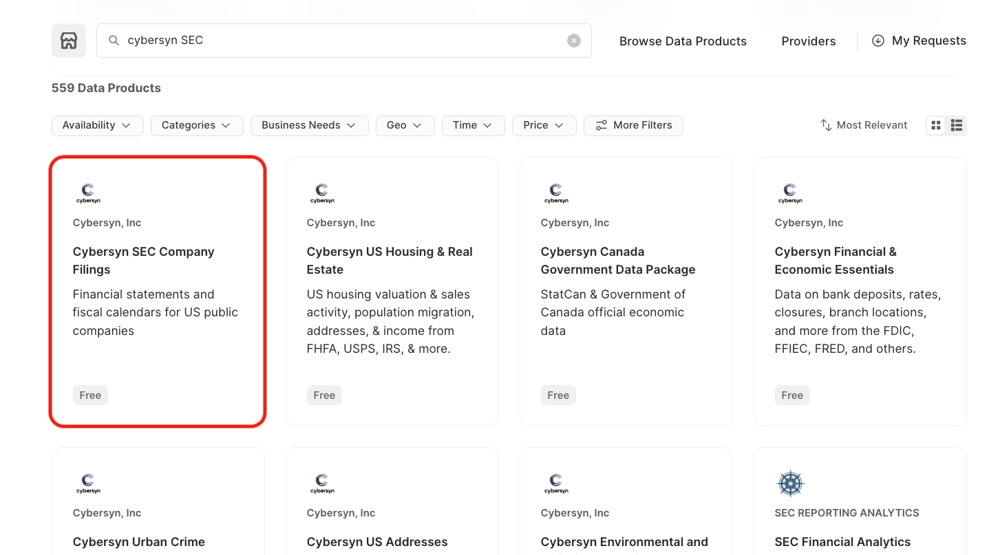
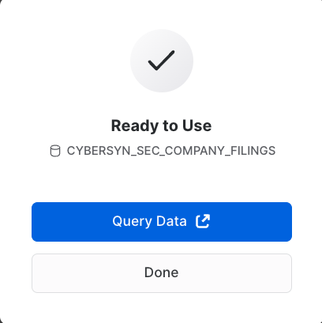

author: jcarroll, rmeng, cfrasca
id: frosty_llm_chatbot_on_streamlit_snowflake
summary: Frosty: Build a LLM Chatbot in Streamlit on your Snowflake Data 
categories: LLM, Streamlit
environments: web
status: Hidden
feedback link: https://github.com/Snowflake-Labs/sfguides/issues
tags: // TODO: add relevant tags here 

# Frosty: Build a LLM Chatbot in Streamlit on your Snowflake Data
<!-- ------------------------ -->
## Overview 
Duration: 2


In this guide, we will build an LLM-powered chatbot named "Frosty" that performs data exploration and question answering by writing and executing SQL queries on Snowflake data.

The application uses Streamlit and Snowflake and can be plugged into your LLM of choice, alongside data from Snowflake Marketplace. By the end of the session, you will have an interactive web application chatbot which can converse and answer questions based on a public job listings dataset.

### Key Features & Technology

// *TODO: Describe what these are somewhere / why they matter*

* Large Language Models (LLMs)
* Streamlit
* Snowflake Marketplace

### Prerequisites

* Accountadmin role access in Snowflake or a Snowflake trial account: [https://signup.snowflake.com/](https://signup.snowflake.com/)
* Access (API Key) for OpenAI or another Large Language Model
* Basic knowledge of SQL, database concepts, and objects
* Familiarity with Python.  All code for the lab is provided.
* Ability to install and run software on your computer
* [VSCode](https://code.visualstudio.com/download) installed

### What you'll learn

### What you'll build

<!-- ------------------------ -->
## Prepare your environment
Duration: 8

// *TODO: VERIFY THESE INSTRUCTIONS WORK!!!*

1. Install conda to manage a separate environment by running pip install conda. NOTE: The other option is to use [Miniconda](https://docs.conda.io/en/latest/miniconda.html)
2. Open the terminal or command prompt

> aside positive
> IMPORTANT:
> If you are using a machine wth Apple M1 chip, follow [these instructons](https://docs.snowflake.com/en/developer-guide/snowpark/python/setup) to create the virtual environment and install Snowpark Python instead of what's described below.

3. Create environment by running `conda create --name snowpark -c https://repo.anaconda.com/pkgs/snowflake python=3.8`
4. Activate conda environment by running `conda activate snowpark`
5. Install Snowpark for Python and openai by running `conda install -c https://repo.anaconda.com/pkgs/snowflake snowflake-snowpark-python openai`
6. Install Streamlit by running `pip install streamlit` or `conda install streamlit`

---

### Troubleshooting `pyarrow` related issues

- If you have `pyarrow` library already installed, uninstall it before installing Snowpark.
- If you do not have `pyarrow` installed, you do not need to install it yourself; installing Snowpark automatically installs the appropriate version.
- Do not reinstall a different version of `pyarrow` after installing Snowpark.

<!-- ------------------------ -->
## Accessing Data on Snowflake Marketplace

Duration: 4

Snowflake Marketplace provides visibility to a wide variety of datasets from third-party data stewards which broaden access to data points used to transform business processes. Snowflake Marketplace also removes the need to integrate and model data by providing secure access to data sets fully maintained by the data provider.

// *TODO: Log into snowsight*

* At the top left corner, make sure you are logged in as ACCOUNTADMIN, switch role if not
* Click on Marketplace
* At the Search bar, type: CyberSyn SEC then click on the Tile Box labeled: CyberSyn SEC Company Filings.




* At the top right corner, Select Get Data
* Select the appropriate roles to access the Database being created and accept the Snowflake consumer terms and CyberSyn's terms of use.
* Create Database



* At this point you can select Query Data, this will open a worksheet with example queries.

// *TODO: Add example queries image?*

* We are interested in ... data, so we will use this query to explore the data for the application:
`Add a question here`

    ```sql
    Add a sample SQL query here for the relevant table
    ```

<!-- ------------------------ -->
## Setting up Streamlit environment
Duration: 1

- Do a streamlit hello / hello world app
- Add snowflake creds to secrets and confirm query access to the table from the last section to st.dataframe
- Add openai key to secrets and confirm openai access is working (simple completion)

### Example secrets file

```toml
# .streamlit/secrets.toml

OPENAI_API_KEY = "sk-2v...X"

[connections.snowpark]
user = "<jdoe>"
password = "<my_trial_pass>"
warehouse = "COMPUTE_WH"
role = "ACCOUNTADMIN"
account = "<account-id>"
```

<!-- ------------------------ -->
## Build a simple chatbot application
Duration: 1

<!-- ------------------------ -->
## Add prompt engineering and SQL extraction
Duration: 1

<!-- ------------------------ -->
## Explore the data via natural language
Duration: 1

// *TODO: Add sample questions*

<!-- ------------------------ -->
## Tips, Tricks and next steps
Duration: 1

<!-- ------------------------ -->
## Conclusion and resources
Duration: 1
